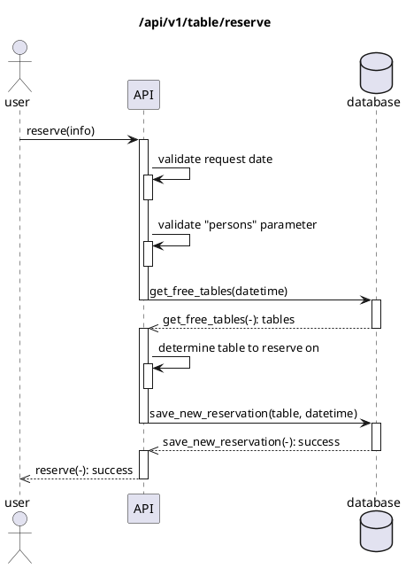

# Sequence Diagrams for API routes

## /api/v1/table/reserve

```plantuml
@startuml
title /api/v1/table/reserve

actor user as u
participant API as a
database database as d

u->a: reserve(info)
activate a
a->a: validate request date
activate a
deactivate a
a->a: validate "persons" parameter
activate a
deactivate a
a->d: get_free_tables(datetime)
deactivate a
activate d
d-->>a: get_free_tables(-): tables
deactivate d
activate a
a->a: determine table to reserve on
activate a
deactivate a
a->d: save_new_reservation(table, datetime)
deactivate a
activate d
d-->>a: save_new_reservation(-): success
deactivate d
activate a
a-->>u: reserve(-): success
deactivate a
```